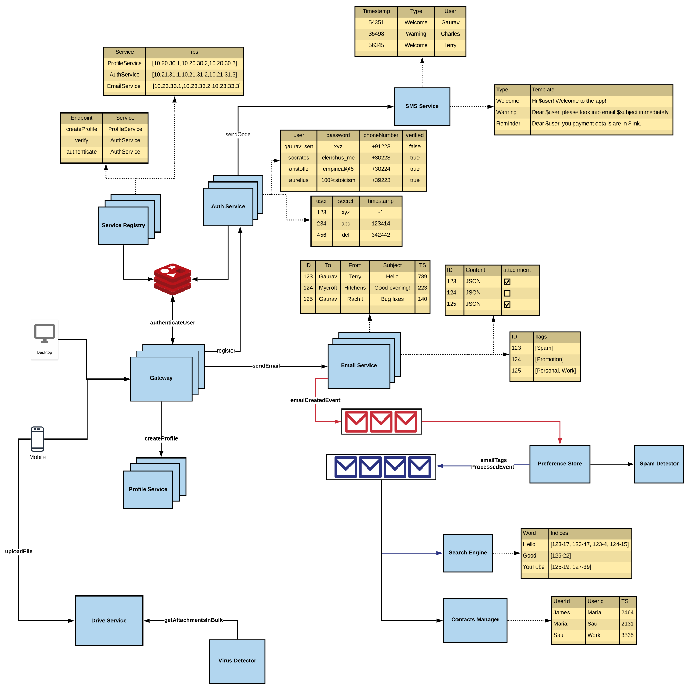

# GMail (Email Service) Design

## Requirements
### Functional Requirements
- User signup, login and profiles
- Send emails with attachments
- Search and view emails
- Contacts and groups
- Spam and virus detection

### Non-Functional Requirements

## Components
### Gateway
- Route external requests to appropriate services.
- Rate limiting or blacklisting IP addresses.
- Translates requests from say HTTP to any other protocol used internally amongst services say TCP.
- Uses service registry to decide which service to route the request to.
- It maintains in-memory cache of the service mappings to avoid repeated calls to service registry. This cache is updated at regular intervals by the service registry.
- It also maintains in-memory cache of tokens to avoid repeated calls to AuthService. 

### Service Registry
- To relieve the gateway of some load, service registry can be used to decide which service to route the request to.
- During setup, each service sets the accepted routes with the service registry.
- On receiving any request, gateway asks the service registry as to where to redirect the request.
- Maintains cache on gateway.

### AuthService
- Gateway decides to send the /register request with username and password as payload to AuthService after checking from service registry.
- To fulfill this request, AuthService will have its database to store user data like username, encrypted password, phone number and verified status.
- To perform 2FA, AuthService can generate some code and use the SMS service to send SMS with required template to the user. The same code can be stored in separate table mapped with user_id along with some timestamp.
- User enters the correct code and gateway sends the /verify request to AuthService which matches the code and timestamp and updates verified status of user.
- Maintains cache on gateway.

### Global Cache
- Instead of storing all required cache on the gateway and duplicating all data across all instances, the entire cache can be stored external in a global cache.
- Every service will update data on this global cache which the gateway can access.

### DriveService
- Stores all media mapped to some url

### ProfileService
- Gateway sends /createProfile requests to ProfileService. The media in profile is uploaded to DriveService and its corresponding url is sent in request body.
- User can also set preferences which are updated in NoSQL database of ProfileService.

### EmailService
- Gateway sends /sendEmail requests to EmailService. The text data is stored in email store/database along with attachment links. The attachment media is stored in DriveService.

### VirusDetector
- Reads from DriveService to check for malicious files.

### SpamDetector
- Runs as a cron job to scan new emails from email store at regular intervals.
- Or EmailService can publish event on new emails and SpamDetector can subscribe to the message queue to scan emails as per availability.

### PreferenceStore
- PreferenceStore can subscribe to email message queue to assign tags to new emails based on user set tags. Assigned tags are stored against email id.

### SMTP Server
- Used to send emails to external users.

### IMAP Server
- Used to receive emails from external users.

