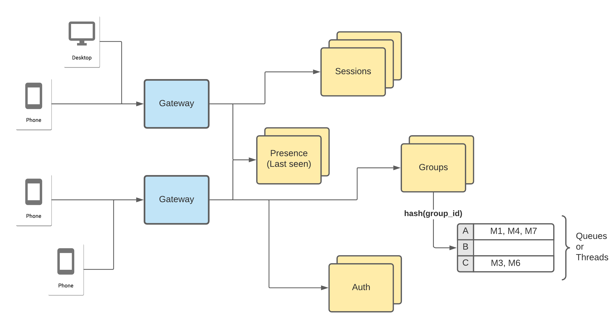

# Whatsapp Design

## Requirements
### Functional
- Signup and login with 2FA
- User preferences
- Send messages to user/group
- Show send/delivered/read receipts
- Show active/last online status
- No loss of messages
- Image sharing

### Non-Functional
- Highly available
- Low latency

### Database VS Distributed File System
- Database provides: Mutabilty, transaction guarantee, indexing for search, access controls.
- Images don't require these properties except access control.
- Thus it makes sense to use file system and setup access control in it.
- File system is cheaper, faster. They are static and can leverage CDN.

### Message flow
- Clients are connected with the gateway through websocket connections, which are peer to peer instead of client and server based.

### SessionService
- Receives messages from sender gateway, stores the message temporarily in its database and finds the receiver gateway.
- Once SessionService stores message, it can update client app that message is sent.
- SessionService finds recipient gateway and tries to send message to them. Once delivered, recipient can update SessionService to tell sender app that the message is delivered.
- Same flow can be followed to update the message read status.

### LastSeenService
- Filters activity from client app and identifies those from user instead of app background activities.
- For every such activity, the service can update the timestamp for the user in its database.

